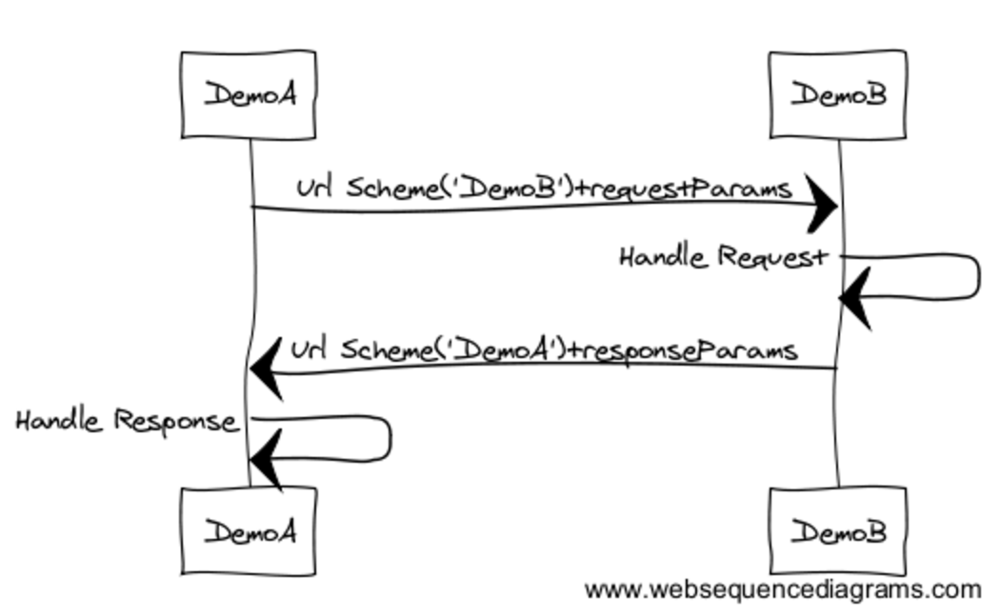
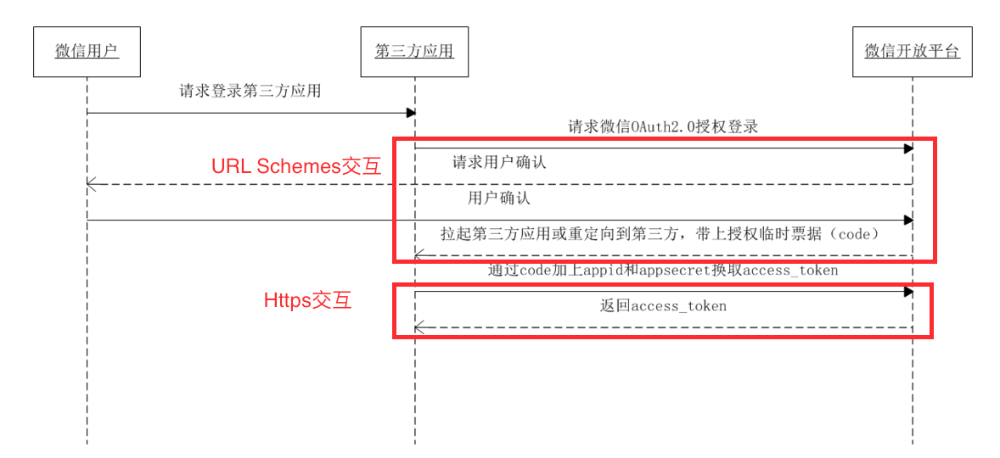

### iOS原生分享控件

```
    NSString *textToShare = @"要分享的文本内容";
    UIImage *imageToShare = [UIImage imageNamed:@"shop"];
    NSURL *urlToShare = [NSURL URLWithString:@"http://blog.csdn.net/hitwhylz"];
    NSArray *activityItems = @[textToShare, imageToShare, urlToShare];
    
    UIActivityViewController *vc = [[UIActivityViewController alloc]initWithActivityItems:activityItems applicationActivities:nil];
    [self presentViewController:vc animated:YES completion:nil];
```

### 三方开放平台

* 新浪微博 http://open.weibo.com
* 腾讯微博 http://dev.t.qq.com
* QQ空间，朋友网 http://connect.qq.com/intro/login/
* QQ分享（QQ好友，QQ群等）http://mobile.qq.com/api/
* 豆瓣社区 http://developers.douban.com
* 人人网 http://dev.renren.com
* 微信好友 微信朋友圈 http://open.weixin.qq.com
* [友盟U-Share](http://mobile.umeng.com/social?spm=0.0.0.0.lW5N4c)
* 用过友盟Share，但是遇到友盟ShareSDK中使用的微信SDK版本与官方不同步的问题，后来放弃了友盟ShareSDK，全部采用原生官方SDK，如微信（好友、朋友圈）、QQ、微博，在国内，这三个分享渠道已经能覆盖80%了。


### URL Schemes

* iOS应用间可以通过`URL Schemes`解决相互通信的问题。
* DemoA通过`openURL`唤起DemoB，并带上参数。

```
DemoA

[[UIApplication sharedApplication] openURL:[NSURL URLWithString:@"demob://page?sourcescheme=demoa"]];
```

* DemoB收到并解析参数并作逻辑处理，然后同样通过`openURL`返回到DemoA，并带上参数。

```
DemoB

- (BOOL)handleUrl:(NSURL *)url {
    NSArray *querys = [url.query componentsSeparatedByString:@"&"];
    
    NSMutableDictionary *queryDict = [[NSMutableDictionary alloc] init];
    for (NSString *q in querys) {
        NSArray *kv = [q componentsSeparatedByString:@"="];
        if (kv.count == 2) {
            queryDict[kv[0]] = kv[1];
        }
    }
    
    NSString *returnScheme = queryDict[@"sourcescheme"];
    
    UIAlertController *vc = [UIAlertController alertControllerWithTitle:@"url"
                                                                message:url.absoluteString
                                                         preferredStyle:UIAlertControllerStyleAlert];
    [vc addAction:[UIAlertAction actionWithTitle:@"返回原应用"
                                           style:UIAlertActionStyleDefault
                                         handler:^(UIAlertAction * _Nonnull action) {
                                             [[UIApplication sharedApplication] openURL:[NSURL URLWithString:[NSString stringWithFormat:@"%@://", returnScheme]]];
                                         }]];
    
    [vc addAction:[UIAlertAction actionWithTitle:@"留在当前应用"
                                           style:UIAlertActionStyleCancel
                                         handler:^(UIAlertAction * _Nonnull action) {
                                         }]];
    
    [self.window.rootViewController presentViewController:vc animated:YES completion:nil];
    
    return YES;
}

- (BOOL)application:(UIApplication *)application handleOpenURL:(NSURL *)url NS_DEPRECATED_IOS(2_0, 9_0, "Please use application:openURL:options:") __TVOS_PROHIBITED {
    return [self handleUrl:url];
}

- (BOOL)application:(UIApplication *)application openURL:(NSURL *)url sourceApplication:(nullable NSString *)sourceApplication annotation:(id)annotation NS_DEPRECATED_IOS(4_2, 9_0, "Please use application:openURL:options:") __TVOS_PROHIBITED {
    return [self handleUrl:url];
}

- (BOOL)application:(UIApplication *)app openURL:(NSURL *)url options:(NSDictionary<NSString*, id> *)options NS_AVAILABLE_IOS(9_0) {
    return [self handleUrl:url];

}
```




### 三方分享或认证

* 三方应用分享或认证都会用到`URL Schemes`流程，实际过程和参数会更复杂点，还需要考虑安全性。
* 如微信三方登录认证，除了三方应用通过URL Scheme跳转微信拿到code，再通过https请求微信后台拿到access_token，后续用https带上access_token可以请求各种资源。

* 三方分享则是通过`URL Schemes`带上不同格式的数据（文本、图片、链接等）。


